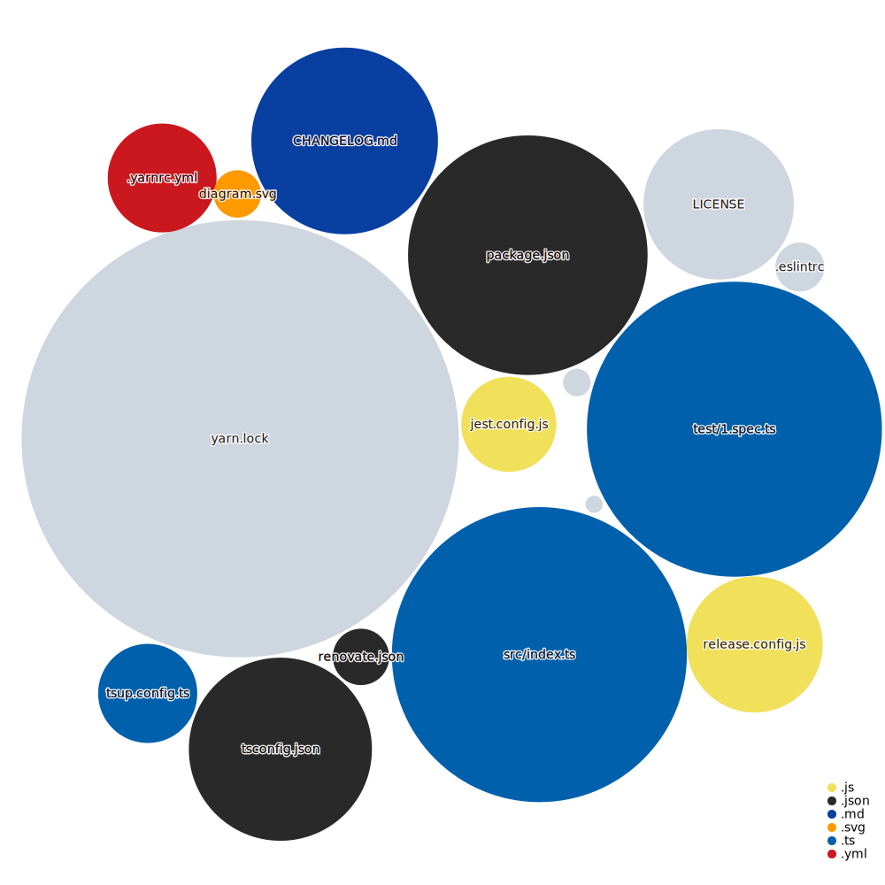

# esbuild-typescript-library-template

A template for building a library through typescript and bundling it through esbuild.

Uses PNPM, Biome, and Github Actions for CI/CD.

## Getting started

1. `git clone git@github.com:spa5k/esbuild-typescript-library-template.git my-project`
2. `cd my-project`
3. `pnpm install`

### Releasing

This uses manual release, go to actions tab and trigger the type of release you want (Major, Minor, Patch)

### Visualization of this Repo.

